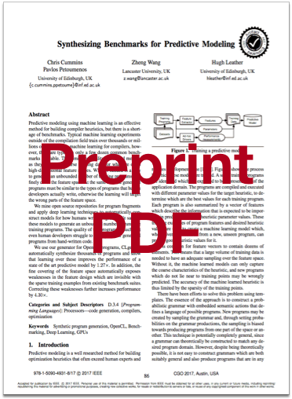

# Synthesizing Benchmarks for Predictive Modeling
[Chris Cummins](http://chriscummins.cc/),
[Pavlos Petoumenos](http://homepages.inf.ed.ac.uk/ppetoume/),
[Zheng Wang](http://www.lancaster.ac.uk/staff/wangz3/),
[Hugh Leather](http://homepages.inf.ed.ac.uk/hleather/).

**Winner of Best Paper Award CGO'17**

<a href="https://speakerdeck.com/chriscummins/synthesizing-benchmarks-for-predictive-modelling-cgo-17">
  
</a>
<a href="https://github.com/ChrisCummins/paper-synthesizing-benchmarks/raw/master/paper.pdf">
  
</a>


**Abstract**
> Predictive modeling using machine learning is an effective method for building
> compiler heuristics, but there is a shortage of benchmarks. Typical machine
> learning experiments outside of the compilation field train over thousands or
> millions of examples. In machine learning for compilers, however, there are
> typically only a few dozen common benchmarks available. This limits the
> quality of learned models, as they have very sparse training data for what are
> often high-dimensional feature spaces. What is needed is a way to generate an
> unbounded number of training programs that finely cover the feature space. At
> the same time the generated programs must be similar to the types of programs
> that human developers actually write, otherwise the learning will target the
> wrong parts of the feature space.
>
> We mine open source repositories for program fragments and apply deep learning
> techniques to automatically construct models for how humans write programs. We
> then sample the models to generate an unbounded number of runnable training
> programs, covering the feature space ever more finely. The quality of the
> programs is such that even human developers struggle to distinguish our
> generated programs from hand-written code.
>
> We use our generator for OpenCL programs, CLgen, to automatically synthesize
> thousands of programs and show that learning over these improves the
> performance of a state of the art predictive model by 1.27x. In
> addition, the fine covering of the feature space automatically exposes
> weaknesses in the feature design which are invisible with the sparse training
> examples from existing benchmark suites. Correcting these weaknesses further
> increases performance by 4.30x.

**Keywords**  Synthetic program generation, OpenCL, Benchmarking, Deep Learning, GPUs

```
@inproceedings{cummins2017a,
  title={Synthesizing Benchmarks for Predictive Modeling},
  author={Cummins, Chris and Petoumenos, Pavlos and Wang, Zheng and Leather, Hugh},
  booktitle={CGO},
  year={2017},
  organization={IEEE}
}
```

## License

The code for this paper (everything in the directory `code`) is released under
the terms of the GPLv3 license. See [LICENSE](LICENSE) for details. Everything
else (i.e. the LaTeX sources and data sets) are unlicensed, please contact
Chris Cummins <chrisc.101@gmail.com> before using.


## Acknowledgements

* [@AdamHarries](https://github.com/AdamHarries) for reviewing early drafts of
  the paper.
* [@jcjohnson](https://github.com/jcjohnson) for guidance on hacking the LSTM.
* Volunteers at [@codeplaysoftware](https://github.com/codeplaysoftware/) and
  [University of Edinburgh](http://www.ed.ac.uk/ ) for particpating in the
  qualitative evaluation.
* EPSRC grants
  EP/L01503X/1 ([CDT in Pervasive Parallelism](http://pervasiveparallelism.inf.ed.ac.uk/)),
  EP/L000055/1 (ALEA),
  EP/M01567X/1 (SANDeRs),
  EP/M015823/1,
  and EP/M015793/1 (DIVIDEND)
